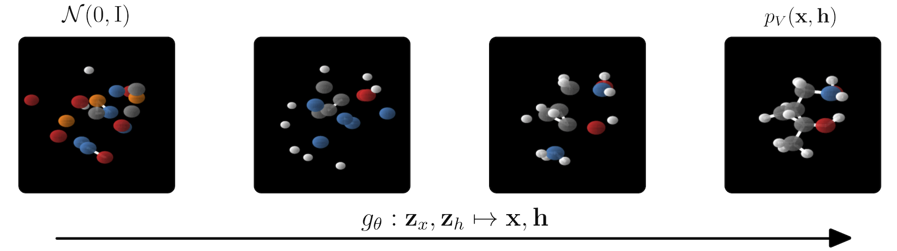

# E(n) Equivariant Normalizing Flows

Official implementation (Pytorch 1.7.1) of:

**E(n) Equivariant Normalizing Flows**  
Victor Garcia Satorras*, Emiel Hogeboom*, Fabian Fuchs, Ingmar Posner, Max Welling  
https://arxiv.org/abs/2105.09016




**Abstract**: This paper introduces a generative model equivariant to Euclidean symmetries: E(n) Equivariant Normalizing Flows (E-NFs). To construct E-NFs, we take the discriminative E(n) graph neural networks and integrate them as a differential equation to obtain an invertible equivariant function: a continuous-time normalizing flow. We demonstrate that E-NFs considerably outperform baselines and existing methods from the literature on particle systems such as DW4 and LJ13, and on molecules from QM9 in terms of log-likelihood. To the best of our knowledge, this is the first flow that jointly generates molecule features and positions in 3D.


### Requirements
* Pytorch 1.7.1
* wandb (Weights and Biases)
* rdkit-pypi (Only for evaluation scripts)

You can use your Weights & Biases username by adding `--wandb_usr <your username>` to the experiments

### DW4 commands  
GNN  
```  
EXP_NAME=exp_dw4_gnn_noatt_noaug python -u main_dw4_lj13.py --exp_name $EXP_NAME --data dw4 --model gnn_dynamics --sweep_n_data True --lr 1e-3 --n_layers 3 --nf 32 --data_augmentation False --attention False
```  
GNN attention  
```
EXP_NAME=exp_dw4_gnn_att_noaug python -u main_dw4_lj13.py --exp_name $EXP_NAME --data dw4 --model gnn_dynamics --sweep_n_data True --lr 1e-3 --n_layers 3 --nf 32 --data_augmentation False
```  
GNN attention and augmentation  
```
EXP_NAME=exp_dw4_gnn_att_aug python -u main_dw4_lj13.py --exp_name $EXP_NAME --data dw4 --model gnn_dynamics --sweep_n_data True --lr 1e-3 --n_layers 3 --nf 32 --data_augmentation True
```    
Simple dynamics. 
```
EXP_NAME=exp_dw4_simple_dynamics python -u main_dw4_lj13.py --exp_name $EXP_NAME --data dw4 --model simple_dynamics --sweep_n_data True --lr 1e-3 --n_layers 3 --nf 32 --data_augmentation False
```  
Kernel dynamics 
```
EXP_NAME=exp_dw4_kernel_dynamics python -u main_dw4_lj13.py --exp_name $EXP_NAME --data dw4 --model kernel_dynamics --sweep_n_data True --lr 1e-3 --n_layers 3 --nf 32 --data_augmentation False
```  
E-NF 
```
EXP_NAME=exp_dw4_egnn python -u main_dw4_lj13.py --exp_name $EXP_NAME --data dw4 --model egnn_dynamics --sweep_n_data True --lr 5e-4 --n_layers 3 --nf 32
``` 

### LJ13 dataset
GNN 
```
EXP_NAME=exp_lj13_gnn_noatt_noaug python -u main_dw4_lj13.py --exp_name $EXP_NAME --data lj13 --model gnn_dynamics --sweep_n_data True --lr 1e-3 --n_layers 3 --nf 32 --data_augmentation False --attention False
```

GNN attention
``` 
EXP_NAME=exp_lj13_gnn_att python -u main_dw4_lj13.py --exp_name $EXP_NAME --data lj13 --model gnn_dynamics --sweep_n_data True --lr 1e-3 --n_layers 3 --nf 32 --data_augmentation False
``` 
GNN attention and augmentation 
```
EXP_NAME=exp_lj13_gnn_att_aug_a python -u main_dw4_lj13.py --exp_name $EXP_NAME --data lj13 --model gnn_dynamics --sweep_n_data True --lr 1e-3 --n_layers 3 --nf 32 --data_augmentation True
``` 

Simple dynamics 
```
EXP_NAME=exp_lj13_simple_dynamics python -u main_dw4_lj13.py --exp_name $EXP_NAME --data lj13 --model simple_dynamics --sweep_n_data True --lr 1e-3 --n_layers 3 --nf 32 --data_augmentation False
``` 

Kernel dynamics 
```
EXP_NAME=exp_lj13_kernel_dynamics python -u main_dw4_lj13.py --exp_name $EXP_NAME --data lj13 --model kernel_dynamics --sweep_n_data True --lr 1e-3 --n_layers 3 --nf 32 --data_augmentation False
``` 

EGNN 
```
EXP_NAME=exp_lj13_egnn python -u main_dw4_lj13.py --exp_name $EXP_NAME --data lj13 --model egnn_dynamics --sweep_n_data True --lr 5e-4 --n_layers 3 --nf 32
``` 

### QM9 Positional

E-NF 
```
EXP_NAME=qm9pos_exp_27_egnn_nf64 python -u main_qm9_pos.py --exp_name $EXP_NAME --model egnn_dynamics --nf 64
``` 

GNN 
```
EXP_NAME=qm9pos_exp_27_gnn_noatt_nf64 python -u main_qm9_pos.py --exp_name $EXP_NAME --model gnn_dynamics --nf 64 --lr 5e-4 --attention False 
```

GNN attention 
```
EXP_NAME=qm9pos_exp_27_gnn_att_nf64 python -u main_qm9_pos.py --exp_name $EXP_NAME --model gnn_dynamics --nf 64 --lr 5e-4 --save_model True 
``` 

GNN attention and augmentation 
```
EXP_NAME=qm9pos_exp_27_gnn_att_aug_nf64 python -u main_qm9_pos.py --exp_name $EXP_NAME --model gnn_dynamics --nf 64  --lr 5e-4 --save_model True
``` 

Kernel dynamics 
```
EXP_NAME=qm9pos_exp_27_kernel_dynamics python -u main_qm9_pos.py --exp_name $EXP_NAME --model kernel_dynamics --lr 5e-4
``` 

Simple dynamics 
```
EXP_NAME=qm9pos_exp_27_simple_dynamics_lr2e4 python -u main_qm9_pos.py --exp_name $EXP_NAME --model simple_dynamics --lr 2e-4 
``` 


### QM9
E-NF
```
python main_qm9.py --nf 64 --ode_regularization 0.001 --batch_size 128 --dequantizer argmax_variational --lr 5e-4 --exp_name qm9_enf --model egnn_dynamics
```

To train the best baseline on qm9 (GNN attention and augmentation)
```
python main_qm9.py --nf 64 --ode_regularization 0.001 --batch_size 128 --dequantizer argmax_variational --lr 5e-4 --exp_name qm9_baseline_augmentation --model gnn_dynamics --data_augmentation True
``` 

To resume the training on qm9 in case it diverges, you can use the same commands as before but adding two argumens. You will get experiments/<exp_name>_resume_resume
``--resume experiments/<exp_name> --start_epoch <last_saved_epoch>``

To evaluate a pre-trained model on QM9 (n_samples=10000 for the reported numbers in the paper) 
```
python -u eval_analyze_qm9.py --model_path outputs/en_flows_pretrained --n_samples 1000 --val_novel_unique False
``` 

To generate samples from a pre-trained model run 
```
python -u eval_sample_qm9.py --model_path outputs/en_flows_pretrained
``` 


#### Acknowledgements
The Robert Bosch GmbH is acknowledged for financial support.

